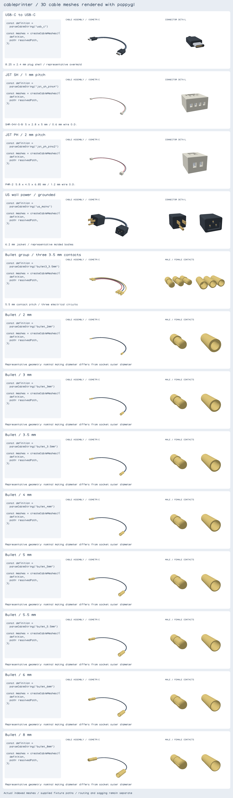
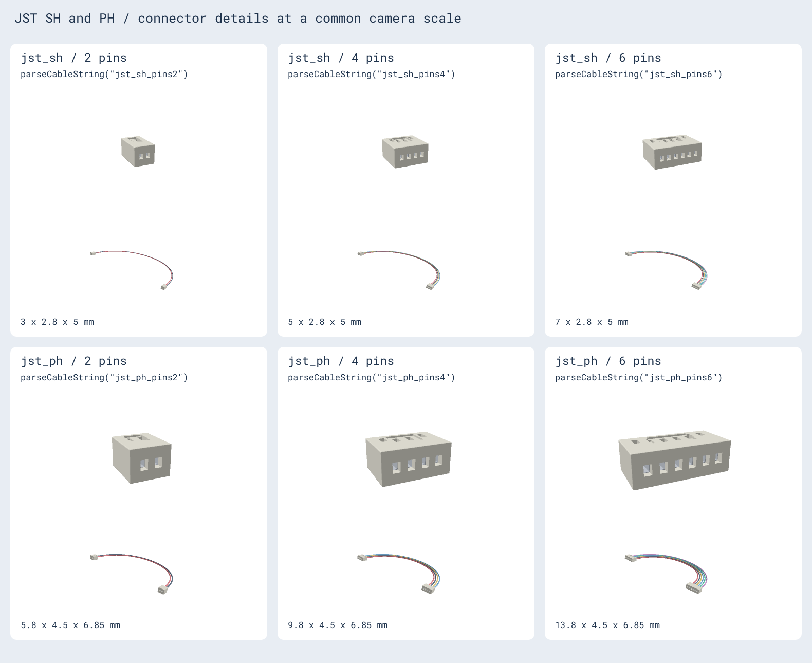
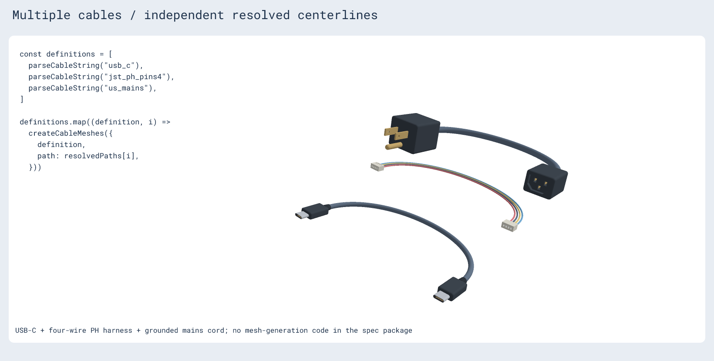
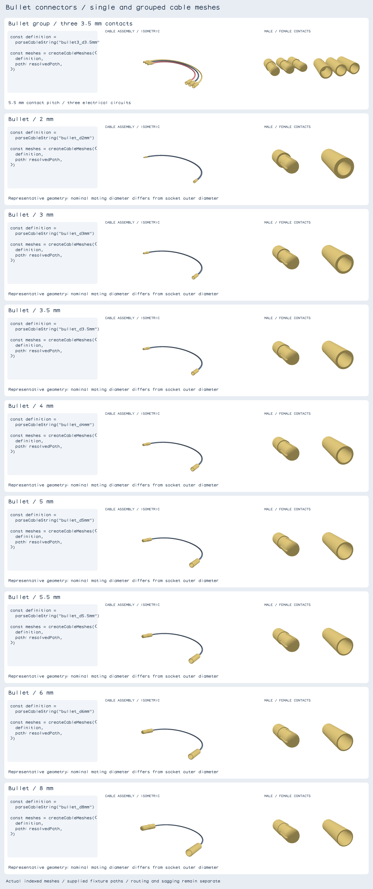
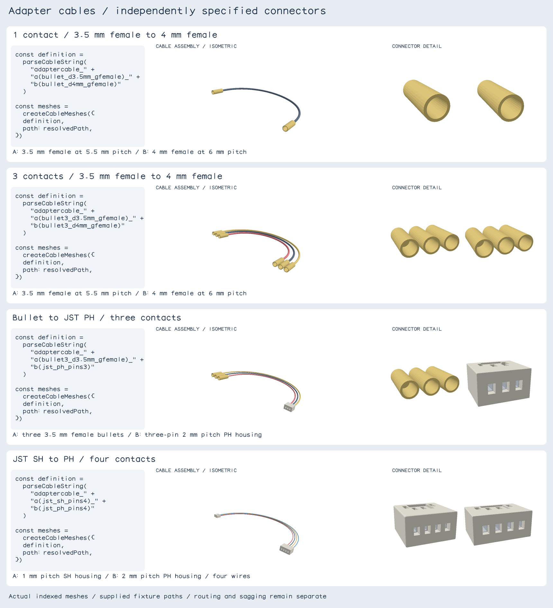

# cableprinter

Physical cable definitions for tscircuit assemblies: connector pairs, connector
dimensions, insulated wires and jacket cross sections. This package defines the
cable independently of its placement, route and 3D mesh.

```sh
npm install @tscircuit/cableprinter
```

```ts
import { getCableDefinition, parseCableString } from "@tscircuit/cableprinter"

const usb = parseCableString("usb_c")
const motorCable = parseCableString("jst_ph_pins4")
const sensorCable = getCableDefinition({
  standard: "jst_sh",
  pinCount: 4,
  wireDiameter: 0.6,
})
const powerCord = parseCableString("us_mains")
```

## Cable types

All dimensions are in millimeters. `wireDiameter` includes insulation;
`jacketDiameter` is the outside diameter of the complete jacket.

| Standard | Connector A / connector B | Defaults | Options |
| --- | --- | --- | --- |
| `usb_c` | USB-C plug / USB-C plug | 4 mm round jacket | `jacketDiameter`, `color` |
| `jst_sh` | JST SH housing / JST SH housing, 1 mm pitch | 4 pins, 0.6 mm insulated wires | `pinCount` (2–15), `wireDiameter` (0.4–0.8 mm) |
| `jst_ph` | JST PH housing / JST PH housing, 2 mm pitch | 2 pins, 1.2 mm insulated wires | `pinCount` (2–16), `wireDiameter` (0.8–1.5 mm) |
| `us_mains` | NEMA 5-15P / IEC C13 | 6.2 mm round jacket | `jacketDiameter`, `color` |

The string DSL accepts `usb_c`, `us_mains`, `jst_sh[_pinsN]` and
`jst_ph[_pinsN]`. Use the object form for cross-section options. Invalid names,
unknown suffixes and out-of-range pin counts throw. Input schemas are strict.

`getCableDefinition` returns a JSON-serializable `CableDefinition` with
`standard`, `connectorA`, `connectorB` and `crossSection`. Both the input and
normalized definition have exported Zod schemas. A JST bundle has one insulated
wire per connector contact. Its colors distinguish wires in the gallery; they
do not define an electrical pin mapping. USB and mains describe the outside
jacket, without inferring internal conductor wiring or electrical ratings.

Each connector's local mating face is centered on x/y at z=0, with its cable
exit along +z. An assembly places these local frames at its resolved endpoints.

## Gallery and snapshots







```sh
bun install
bun run start        # Cosmos: common cables, JST variants, multiple cables, playground
bun run build:site   # Static Cosmos gallery in cosmos-export/
bun test
bun run test:update  # Explicitly regenerate annotated PNG snapshots
bun run typecheck
bun run format:check
```

The snapshots render actual indexed triangle meshes with poppygl. Meshes come
from `jscad-electronics/cables`, consumed as a dev dependency. The gallery
includes isometric cable assemblies, connector close-ups, JST pin-count
comparisons and three separate cables in one scene. The playground renders
meshes live on a canvas with poppygl.

Code appears at left and 3D renders at right. Authored centerlines are resolved
fixtures, separate from automatic routing and sagging. SVG is used only to lay
out labels and PNGs; there are no SVG cable drawings. Geometry generation
remains outside this spec package. Snapshot annotations use `@tscircuit/alphabet` stroke glyphs and produce diff
images on failure.

## Dimensions and references

- [JST SH drawing](https://www.jst-mfg.com/product/pdf/eng/eSH.pdf), housing table:
  SH without side protrusions (`SHR-xxV-S-B`), width `pinCount + 1`, height 2.8,
  depth 5. Insulation range 0.4–0.8 mm.
- [JST PH drawing](https://www.jst-mfg.com/product/pdf/eng/ePH.pdf), PHR housing
  table: width `(pinCount - 1) * 2 + 3.8`, height 4.5, depth 6.85. The default
  wire range corresponds to SPH-002 contacts.
- [Amphenol USB-C plug drawing](https://cdn.amphenol-cs.com/media/wysiwyg/files/drawing/10133475.pdf):
  nominal 8.25 x 2.4 mm shell face. Shell depth and overmold dimensions are
  representative visualization defaults.
- [Interpower cord-set reference](https://www.interpower.com/docs/connections_2_6-04.pdf):
  NEMA 5-15 to IEC C13 with representative 6.2 mm jacket diameter (3 x 18 AWG SVT).
  Molded body dimensions and contact geometry are representative visualization models.

These definitions support assembly visualization, not connector manufacturing
or electrical certification.

## Package boundaries

`lib` contains schemas, defaults and string parsing. World endpoints and the
resolved cable path belong to the assembly/routing layer and Circuit JSON.
Mesh generation is provided by `jscad-electronics/cables`. It consumes the
definition and resolved path;
it should not choose or recompute the route. Several cables are simply several
independent definitions, each paired with its own path.

This initial package does not yet integrate these standards into
`<assembly.cable>` or generate Circuit JSON cable paths.

## Bootstrap and publishing

Follows the [tscircuit handbook bootstrap guide](https://github.com/tscircuit/handbook/blob/main/guides/bootstrapping-repos.md):
`lib/index.ts` source entrypoint, no lockfile, Biome, Bun test,
typecheck/format workflows, Cosmos and Vite aliases. Templates are from
`@tscircuit/plop`. The npm package contains compiled ESM and TypeScript
declarations in `dist`, built with `bun run build`. `bun run test:package`
checks the exported package entrypoint in Node.

Install from npm:

```sh
npm install @tscircuit/cableprinter
```

The `bun-pver-release.yml` GitHub Actions workflow publishes releases through
npm trusted publishing, with signed provenance and no npm token secret.


## Bullet connectors

`bullet_d3.5mm` defaults to a male-to-female single-wire cable. Specify both end
genders with `bullet_d3.5mm_afemale_bmale`, `bullet_d4mm_amale_bmale`, or
`bullet_d4mm_afemale_bfemale`. Supported nominal mating diameters are 2, 3, 3.5,
4, 5, 5.5, 6, and 8 mm. Size is required; no connector diameter is inferred.

```ts
getCableDefinition({
  standard: "bullet",
  diameter: 3.5,
  genderA: "male",
  genderB: "female",
  wireDiameter: 2, // insulation included, mm
  color: "#df4049",
})
```

End genders default independently to male at A and female at B; wire diameter
defaults to 2 mm and color to `#263449`. Dimensions describe representative
solder bullets with gold contacts, male spring slots, female socket recesses,
and solder cups. Nominal contact diameter differs from socket outer diameter.
They are visualization models, not manufacturer-specific fabrication drawings.
The separate bullet gallery pairs code with actual meshes for every supported
diameter and a three-contact cable.



Grouped bullets use `bullet3_d3.5mm` (three male/female contact pairs) or
`bullet3_d3.5mm_afemale_bmale`. The object form adds `pinCount: 3`; counts 1–16
are supported and default to 1. Each contact has its own insulated wire,
spaced at nominal diameter + 2 mm, with distinct display colors. The contact
Contact counts must match at both ends.

All modifiers are named and can appear in any order: `d` specifies the nominal
diameter, `a` specifies end A's gender, and `b` specifies end B's gender.
For example, `bullet3_bmale_d3.5mm_afemale` is equivalent to
`bullet3_d3.5mm_afemale_bmale`. Each end's gender is optional and defaults
independently. Positional modifiers, unknown names, and duplicate parameters
are rejected.

### Independent-ended adapter cables

The generic wrapper names two independently specified connectors:

```text
adaptercable_a(bullet3_d3.5mm_gfemale)_b(bullet3_d4mm_gfemale)
adaptercable_a(bullet3_d3.5mm_gfemale)_b(jst_ph_pins3)
adaptercable_a(jst_sh_pins4)_b(jst_ph_pins4)
```

The first example mates with a motor's three 3.5 mm male outputs and a board's
4 mm male plugs. Use `gmale` at B for female board sockets. `g` names a single
connector's gender; `d` names its diameter. Both modifiers are required for
bullet connector strings. A and B may appear in either order; duplicates,
missing ends, positional parameters, nested cables, and trailing tokens fail.
There are no `da`/`db` parameters or `diameterA`/`diameterB` object properties.

Each end is parsed by `parseConnectorString`. Supported connector strings are
`bullet[CONTACTS]_dNmm_gmale|gfemale`, `jst_sh[_pinsN]`, `jst_ph[_pinsN]`,
`usb_c`, `nema_5_15p`, and `iec_c13`. `us_mains` is a two-ended cable preset,
not a connector name. Explicit contact counts must match. The string describes
physical mating interfaces, not electrical pin mapping or ratings.

```ts
getCableDefinition({
  standard: "adaptercable",
  connectorA: parseConnectorString("bullet3_d3.5mm_gfemale"),
  connectorB: parseConnectorString("bullet3_d4mm_gfemale"),
})
```

`getAdapterCableDefinition({ connectorA, connectorB, crossSection? })` exposes
the same composition API. An optional cross section configures wire sizes and
colors. Defaults use separate wires for two explicitly counted multi-contact
ends, or a round jacket otherwise. Each end retains its native contact pitch;
the renderer fans the wires between those pitches along the supplied route.
Existing cable preset strings and their snapshots remain unchanged.

`stringifyConnector` and `stringifyCableDefinition` emit canonical stock strings;
custom dimensions and cross sections stay in the object API. The optional
`useShorthand` serializer flag emits existing cable presets when applicable.


